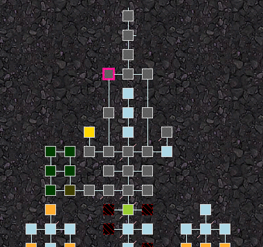

# aardscripts

Random stuff for Aardwolf's MUSHclient, typically in the form of plugins. 

## aard_direction_interceptor.xml

Intercepts direction commands to use mapper cexits if they exist.

## aard_GMCP_mapper_custom.xml

Proof of concept for being able to shift-click and drag a room on the map to move it. Great for areas that overlap. 

This is safe to install along with the default mapper. It uses a separate database to store room position offsets, and no modifications are done to the default mapper database. Obviously, if this was more than a POC you wouldn't _need_ both mappers running. 

Example screenshot of the north end of Aylor where things normally overlap in the temple area - I was able to drag the rooms around to make it visually 'correct':

Limitations:
* Not real-time dragging. It will feel janky. 
* Can only move one room at a time. Not exactly a Mudlet-like experience. 
* You can't move a room indefintely and in all directions in one drag. More jank. 

