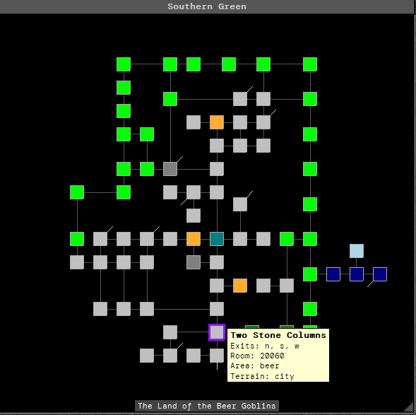

# aardscripts

Random stuff for Aardwolf's MUSHclient, typically in the form of plugins. 

## aard_direction_interceptor.xml

Intercepts direction commands to use mapper cexits if they exist.

## aard_Grid_Mapper.xml

Proof of concept for being able to drag a room on the map to move it. Great for areas that overlap. Rooms that are overlaping will be shown with a "stacked sheet of paper" style look so it is easier to identify. 

This is safe to (and necessary to) install along with the default mapper. It uses a separate database to store room position offsets, and no modifications are done to the default mapper database. It is still using the original mapper for pretty much everything else - this is _just_ handling the display. 

Example screenshot of the Land of the Beer Goblins, with all rooms spread out:

### Usage

Install the plugin as normal. Use "gridmapper help" in-game to see available commands.

